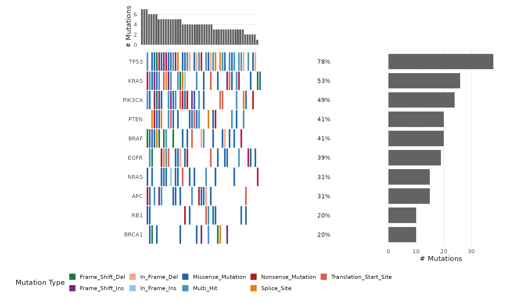
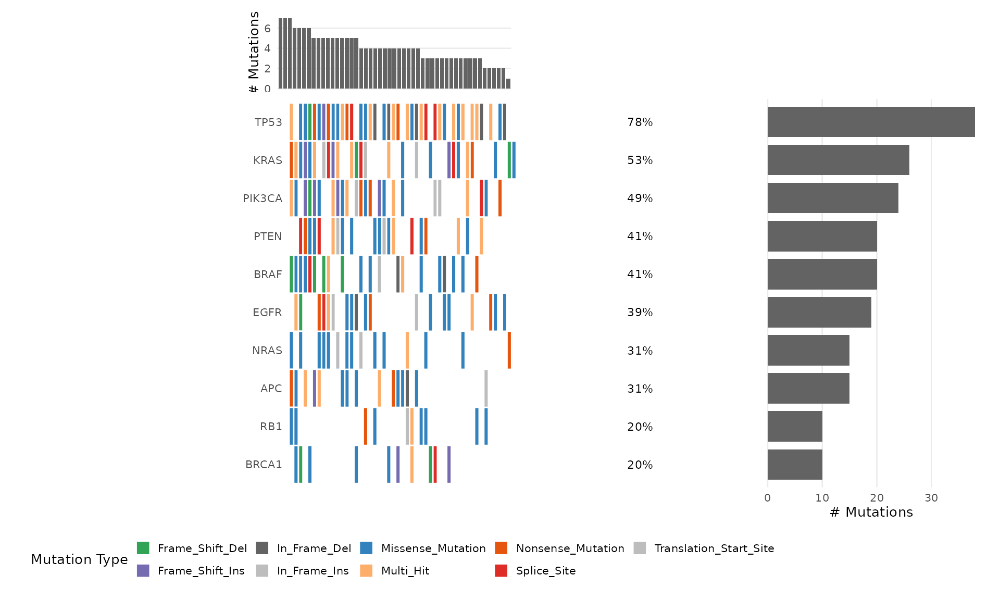
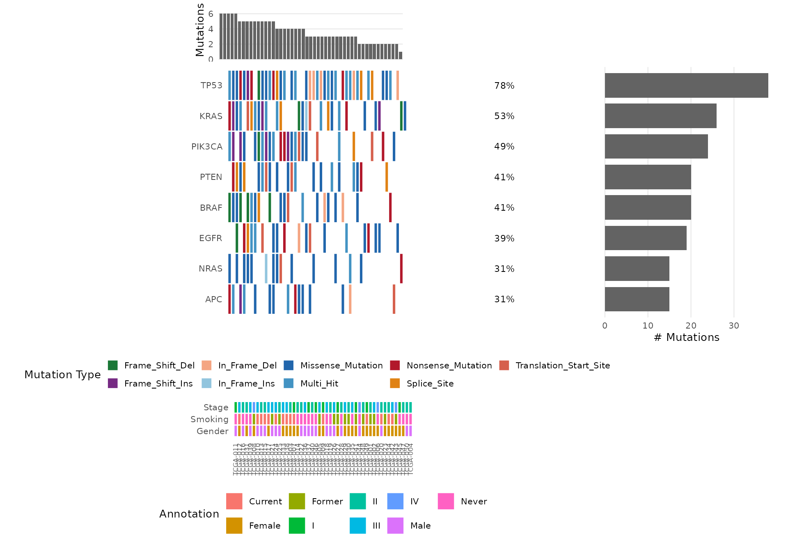
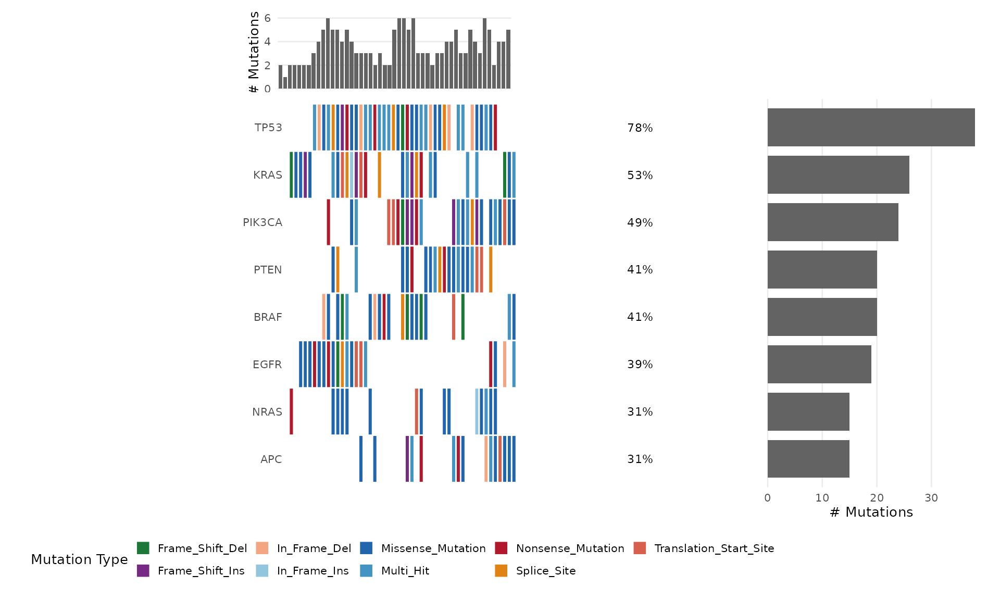
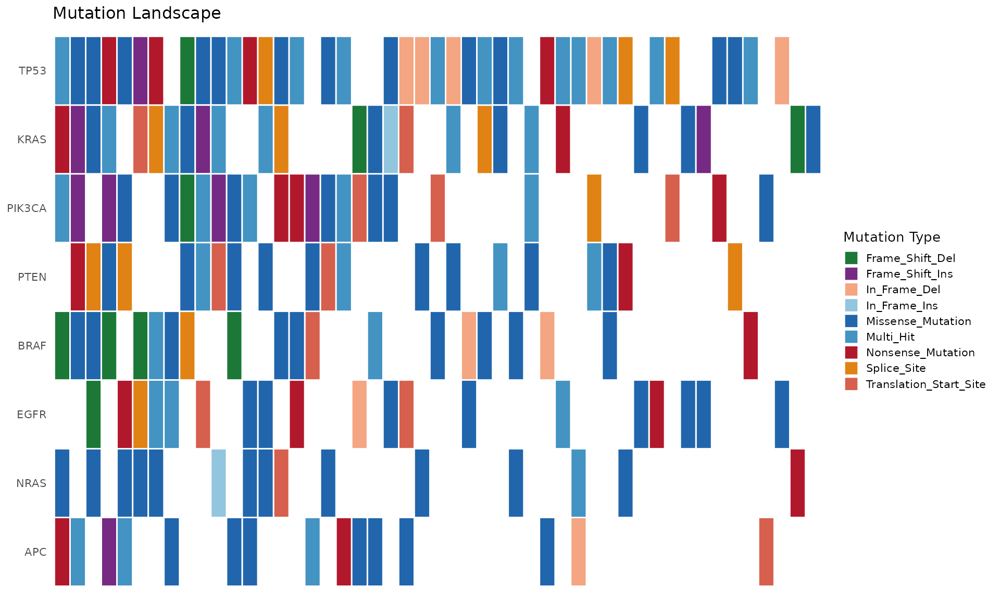

# Creating Onco Plots with bambamR


## Overview

The
[`bb_oncoplot()`](https://r-heller.github.io/bambamR/reference/bb_oncoplot.md)
function creates publication-ready onco plots (waterfall plots) showing
the mutation landscape across samples. It is built entirely with ggplot2
and returns a modifiable ggplot object.

``` r

library(bambamR)
#> bambamR: Full mode (all Bioconductor packages available)
library(ggplot2)
```

## Input Data Format

[`bb_oncoplot()`](https://r-heller.github.io/bambamR/reference/bb_oncoplot.md)
accepts two input formats:

### Simple format

A data.frame with columns `sample`, `gene`, and `mutation_type`:

``` r

# Load bundled example mutation data
ex <- bb_example_mutations()
mut_data <- ex$mutations
clinical_data <- ex$clinical
head(mut_data)
#>     sample   gene     mutation_type
#> 1 TCGA-021   NRAS      In_Frame_Ins
#> 2 TCGA-037 PIK3CA Missense_Mutation
#> 3 TCGA-037   BRAF       Splice_Site
#> 4 TCGA-031 PIK3CA   Frame_Shift_Ins
#> 5 TCGA-042    RB1 Missense_Mutation
#> 6 TCGA-008   NRAS Missense_Mutation
```

### MAF format

A data.frame with MAF-style columns: `Hugo_Symbol`,
`Tumor_Sample_Barcode`, `Variant_Classification`.

## Basic Oncoplot

``` r

bb_oncoplot(mut_data, n_genes = 10)
```



## Customizing Colors

Pass a named character vector to `mutation_colors`:

``` r

my_colors <- c(
  "Missense_Mutation" = "#3182BD",
  "Nonsense_Mutation" = "#E6550D",
  "Frame_Shift_Del"   = "#31A354",
  "Frame_Shift_Ins"   = "#756BB1",
  "Splice_Site"       = "#DE2D26",
  "In_Frame_Del"      = "#636363",
  "Multi_Hit"         = "#FDAE6B",
  "Other"             = "#BDBDBD"
)

bb_oncoplot(mut_data, n_genes = 10, mutation_colors = my_colors)
```



## Selecting Specific Genes

``` r

bb_oncoplot(mut_data, genes = c("TP53", "KRAS", "PIK3CA", "BRAF", "EGFR"))
```


## Adding Clinical Annotations

Provide a data.frame with sample annotations:

``` r

# Use the bundled clinical annotations
bb_oncoplot(mut_data, n_genes = 8, annotation_df = clinical_data)
```



## Sorting Options

Sort samples by mutation frequency (default) or by co-occurrence
clustering:

``` r

bb_oncoplot(mut_data, n_genes = 8, sort_by = "cluster")
```



## Customizing with ggplot2

Since
[`bb_oncoplot()`](https://r-heller.github.io/bambamR/reference/bb_oncoplot.md)
returns a ggplot object, you can further customize:

``` r

p <- bb_oncoplot(mut_data, n_genes = 8, show_barplot = FALSE,
                  title = "Mutation Landscape")
p + theme(legend.position = "right")
```



## Exporting Publication-Quality Figures

``` r

p <- bb_oncoplot(mut_data, n_genes = 15, title = "Cohort Mutation Landscape")
ggsave("oncoplot.pdf", p, width = 12, height = 8, dpi = 300)
ggsave("oncoplot.png", p, width = 12, height = 8, dpi = 300)
```
