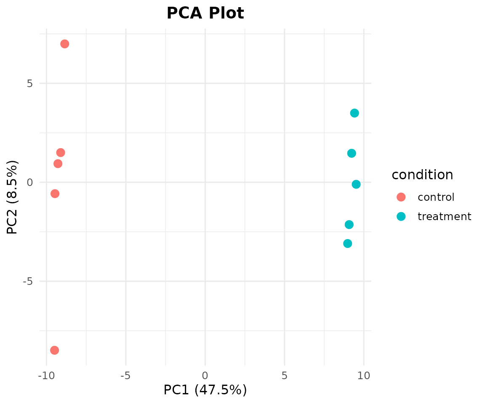
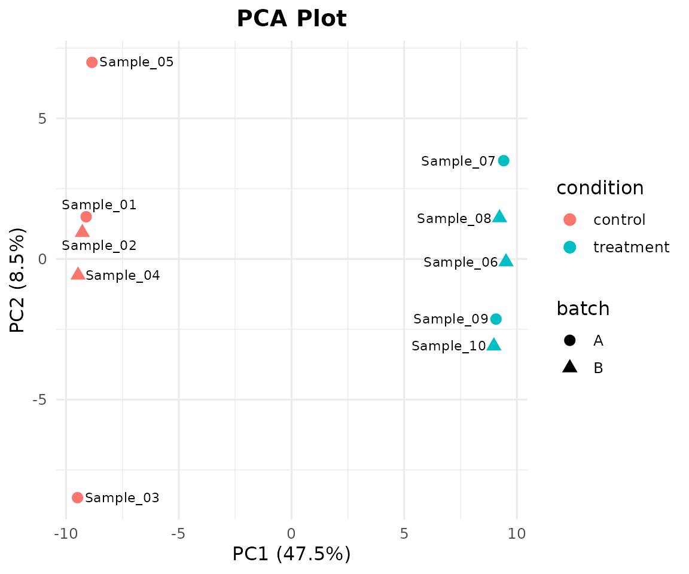
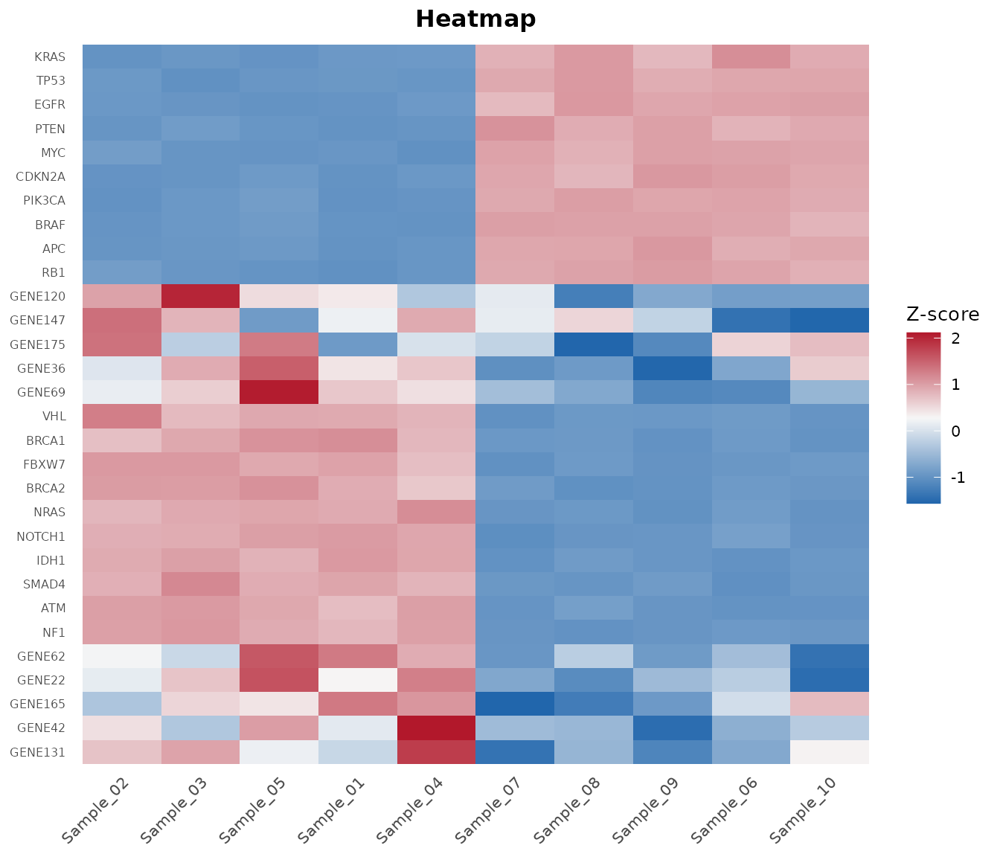
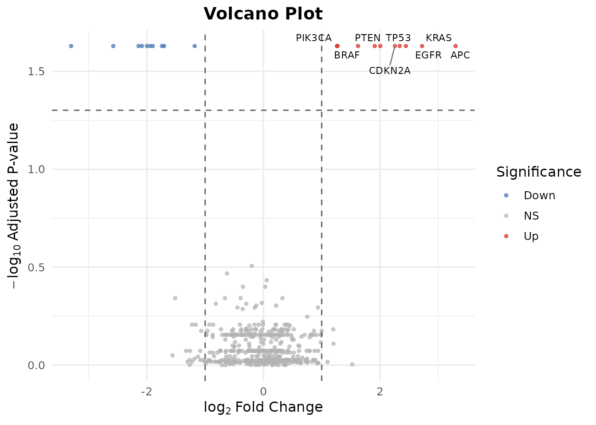
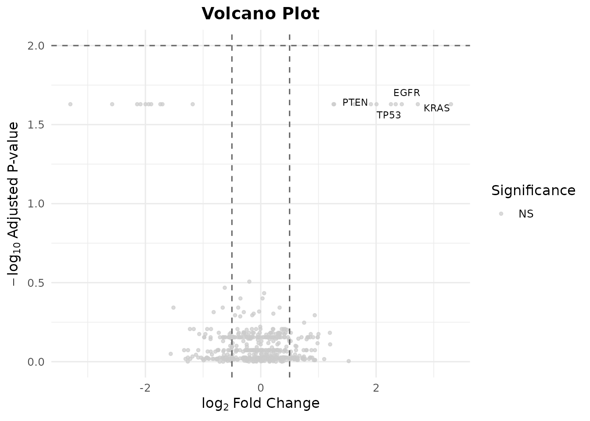
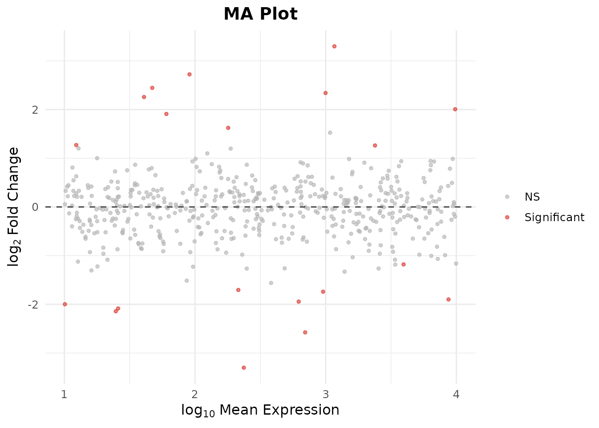
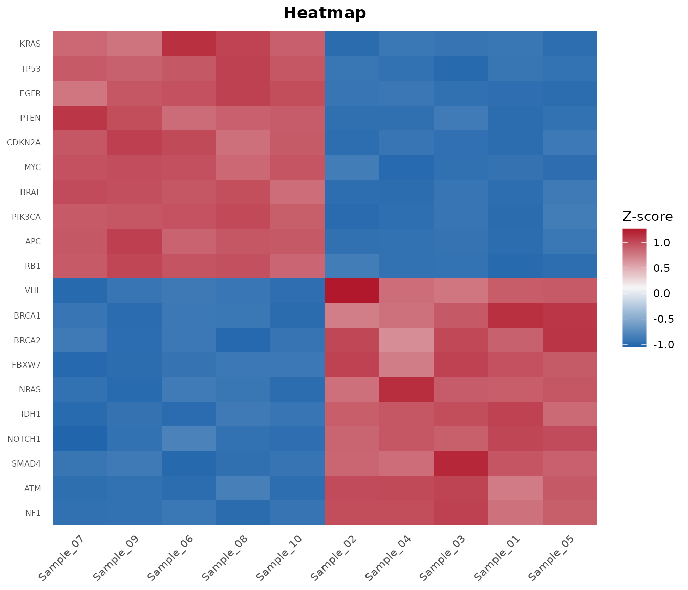
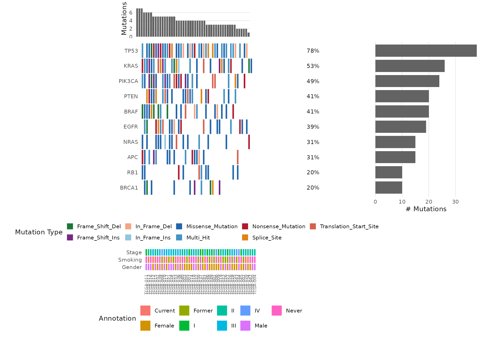
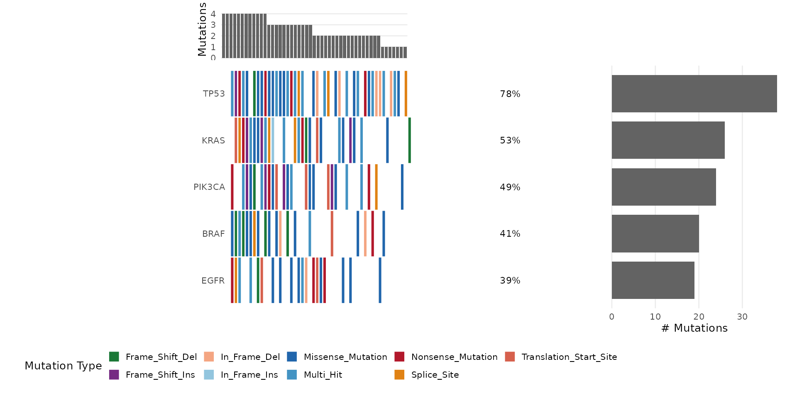
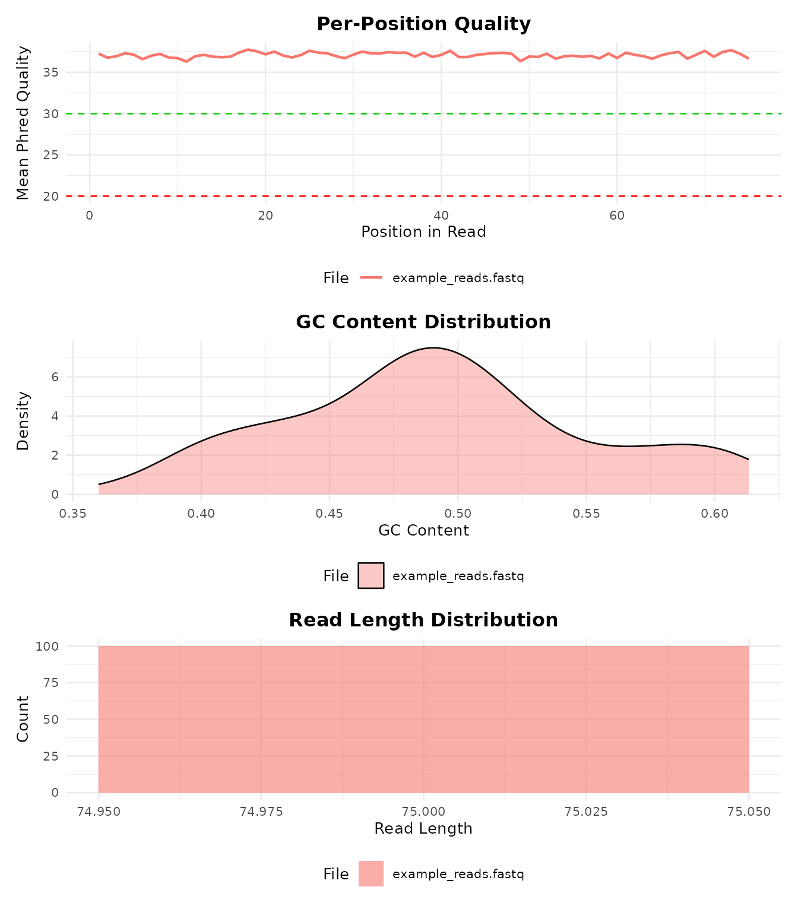

# bambamR Quick Start Guide


## Overview

bambamR is an end-to-end RNA-seq analysis toolkit that takes you from
raw sequencing data (FASTQ/BAM) through alignment, counting,
normalization, differential expression, and publication-ready
visualizations.

It operates in two modes:

- **Minimal mode** (CRAN-only): CPM/TPM normalization, all plots, FASTQ
  import via base R, and system tool wrappers. No Bioconductor needed.
- **Full mode** (+ Bioconductor): DESeq2/edgeR/limma DE analysis,
  TMM/RLE normalization, native BAM/FASTQ parsing via
  Rsamtools/ShortRead.

This vignette walks through a complete analysis using only the bundled
example data – no external files required.

## Installation

``` r
# CRAN
install.packages("bambamR")

# GitHub development version
pak::pak("r-heller/bambamR")

# Optional Bioconductor packages for full mode
BiocManager::install(c("DESeq2", "edgeR", "limma", "ShortRead", "Rsamtools"))
```

``` r
library(bambamR)
#> bambamR: Full mode (all Bioconductor packages available)
```

------------------------------------------------------------------------

## Step 1: Load Example Data

bambamR ships with three example datasets accessible via convenience
functions. Nothing to download – they are bundled with the package.

``` r
# RNA-seq count matrix: 200 genes x 10 samples (5 control, 5 treatment)
ex <- bb_example_counts()
counts   <- ex$counts
metadata <- ex$metadata
```

Let’s inspect the data:

``` r
dim(counts)
#> [1] 200  10
counts[1:6, 1:5]
#>        Sample_01 Sample_02 Sample_03 Sample_04 Sample_05
#> TP53         525       533       485       515       519
#> KRAS         502       471       498       510       475
#> EGFR         479       504       488       514       473
#> BRAF         454       456       481       453       497
#> PIK3CA       470       469       506       483       532
#> PTEN         461       473       513       475       479
```

``` r
metadata
#>           condition batch sex age
#> Sample_01   control     A   M  45
#> Sample_02   control     B   F  52
#> Sample_03   control     A   M  38
#> Sample_04   control     B   F  61
#> Sample_05   control     A   M  55
#> Sample_06 treatment     B   F  47
#> Sample_07 treatment     A   M  59
#> Sample_08 treatment     B   F  42
#> Sample_09 treatment     A   M  50
#> Sample_10 treatment     B   F  44
```

The metadata has columns for **condition** (control vs. treatment),
**batch**, **sex**, and **age**. The first 20 genes in the count matrix
have simulated differential expression between conditions.

------------------------------------------------------------------------

## Step 2: Normalization

CPM normalization works everywhere – no Bioconductor needed:

``` r
cpm <- bb_normalize(counts, method = "cpm")
head(cpm[, 1:3])
#>        Sample_01 Sample_02 Sample_03
#> TP53    5286.849  5348.076  4852.766
#> KRAS    5055.235  4725.974  4982.840
#> EGFR    4823.621  5057.093  4882.783
#> BRAF    4571.866  4575.465  4812.743
#> PIK3CA  4732.989  4705.906  5062.886
#> PTEN    4642.357  4746.042  5132.926
```

TPM normalization requires gene lengths (also bundled):

``` r
gene_lengths <- readRDS(
  system.file("extdata", "example_gene_lengths.rds", package = "bambamR")
)
tpm <- bb_normalize(counts, method = "tpm", gene_lengths = gene_lengths$length)
head(tpm[, 1:3])
#>        Sample_01 Sample_02 Sample_03
#> TP53    1663.711  1692.779  1537.197
#> KRAS    4554.768  4282.901  4519.196
#> EGFR    1089.000  1148.358  1109.638
#> BRAF    3353.235  3375.418  3553.223
#> PIK3CA  1120.653  1120.729  1206.683
#> PTEN    2325.557  2391.343  2588.289
```

With Bioconductor installed you can also use `"tmm"` (edgeR) or `"rle"`
(DESeq2):

``` r
tmm <- bb_normalize(counts, method = "tmm")
```

------------------------------------------------------------------------

## Step 3: PCA Plot

Visualize sample-level structure. Color by any metadata column:

``` r
bb_pca(cpm, metadata, color_by = "condition")
```



Add shape mapping and sample labels:

``` r
bb_pca(cpm, metadata, color_by = "condition", shape_by = "batch", label = TRUE)
```



------------------------------------------------------------------------

## Step 4: Heatmap

Show the top 30 most variable genes:

``` r
bb_heatmap(cpm, n_genes = 30)
```



------------------------------------------------------------------------

## Step 5: Differential Expression

### Option A: With DESeq2 (requires Bioconductor)

``` r
de_results <- bb_deseq2(counts, metadata)
#> estimating size factors
#> estimating dispersions
#> gene-wise dispersion estimates
#> mean-dispersion relationship
#> -- note: fitType='parametric', but the dispersion trend was not well captured by the
#>    function: y = a/x + b, and a local regression fit was automatically substituted.
#>    specify fitType='local' or 'mean' to avoid this message next time.
#> final dispersion estimates
#> fitting model and testing
head(de_results[order(de_results$padj), ])
#>     gene   log2fc pvalue padj  basemean
#> 1   TP53 1.620871      0    0 1050.8776
#> 3   EGFR 1.619625      0    0 1001.6421
#> 5 PIK3CA 1.582527      0    0  983.2855
#> 7    APC 1.617024      0    0 1100.7746
#> 8 CDKN2A 1.584825      0    0 1011.5725
#> 9    RB1 1.548702      0    0 1055.2935
```

### Option B: Use Pre-computed DE Results (no Bioconductor!)

bambamR bundles a realistic pre-computed DE result set so you can
explore all downstream plots without installing Bioconductor:

``` r
de_results <- bb_example_de()
head(de_results[order(de_results$padj), ])
#>     gene   log2fc       pvalue       padj   basemean
#> 1   TP53 2.339649 0.0007574367 0.02349398  997.58686
#> 2   KRAS 2.722469 0.0003361832 0.02349398   90.62812
#> 3   EGFR 2.444921 0.0008361128 0.02349398   47.01289
#> 4   BRAF 1.623780 0.0005590749 0.02349398  179.27216
#> 5 PIK3CA 1.271091 0.0004387668 0.02349398   12.32381
#> 6   PTEN 2.006420 0.0006551589 0.02349398 9793.59126
```

``` r
cat("Total genes:", nrow(de_results), "\n")
#> Total genes: 500
cat("Significant (padj < 0.05):", sum(de_results$padj < 0.05, na.rm = TRUE), "\n")
#> Significant (padj < 0.05): 20
cat("Up-regulated (log2FC > 1):",
    sum(de_results$padj < 0.05 & de_results$log2fc > 1, na.rm = TRUE), "\n")
#> Up-regulated (log2FC > 1): 10
cat("Down-regulated (log2FC < -1):",
    sum(de_results$padj < 0.05 & de_results$log2fc < -1, na.rm = TRUE), "\n")
#> Down-regulated (log2FC < -1): 10
```

------------------------------------------------------------------------

## Step 6: Volcano Plot

``` r
bb_volcano(de_results, fc_cutoff = 1, p_cutoff = 0.05, n_label = 8)
#> Warning: Removed 492 rows containing missing values or values outside the scale range
#> (`geom_text_repel()`).
```



Customize the cutoffs and label specific genes:

``` r
bb_volcano(de_results,
           fc_cutoff = 0.5,
           p_cutoff = 0.01,
           label_genes = c("TP53", "KRAS", "EGFR", "PTEN"),
           colors = c(up = "#E41A1C", down = "#377EB8", ns = "grey80"))
#> Warning: Removed 496 rows containing missing values or values outside the scale range
#> (`geom_text_repel()`).
```



------------------------------------------------------------------------

## Step 7: MA Plot

The MA plot shows log2 fold-change vs. mean expression, highlighting
genes that change at different expression levels:

``` r
bb_ma_plot(de_results, p_cutoff = 0.05)
```



------------------------------------------------------------------------

## Step 8: Heatmap of Top DE Genes

Pass DE results to
[`bb_heatmap()`](https://r-heller.github.io/bambamR/reference/bb_heatmap.md)
to show the top differentially expressed genes instead of the most
variable:

``` r
bb_heatmap(cpm, de_result = de_results, n_genes = 25)
```



------------------------------------------------------------------------

## Step 9: Oncoplot

The oncoplot is bambamR’s signature visualization – a waterfall-style
mutation landscape across samples. Load the bundled mutation data:

``` r
mut <- bb_example_mutations()
head(mut$mutations)
#>     sample   gene     mutation_type
#> 1 TCGA-021   NRAS      In_Frame_Ins
#> 2 TCGA-037 PIK3CA Missense_Mutation
#> 3 TCGA-037   BRAF       Splice_Site
#> 4 TCGA-031 PIK3CA   Frame_Shift_Ins
#> 5 TCGA-042    RB1 Missense_Mutation
#> 6 TCGA-008   NRAS Missense_Mutation
head(mut$clinical)
#>          Stage Gender Smoking
#> TCGA-021   III   Male  Former
#> TCGA-037     I   Male   Never
#> TCGA-031    II Female   Never
#> TCGA-042   III Female Current
#> TCGA-008    IV Female  Former
#> TCGA-029   III Female  Former
```

### Basic Oncoplot

``` r
bb_oncoplot(mut$mutations, n_genes = 10)
```


### With Clinical Annotations

``` r
bb_oncoplot(mut$mutations, n_genes = 10, annotation_df = mut$clinical)
```



### Select Specific Genes

``` r
bb_oncoplot(mut$mutations,
            genes = c("TP53", "KRAS", "PIK3CA", "BRAF", "EGFR"))
```



See
[`vignette("bambamR-oncoplot")`](https://r-heller.github.io/bambamR/articles/bambamR-oncoplot.md)
for more customization options.

------------------------------------------------------------------------

## Step 10: Read FASTQ Files

bambamR includes a small example FASTQ file (100 reads):

``` r
fq_path <- system.file("extdata", "example_reads.fastq", package = "bambamR")
reads <- bb_read_fastq(fq_path, n = 5)
reads
#>                    id
#> 1 read_0001 length=75
#> 2 read_0002 length=75
#> 3 read_0003 length=75
#> 4 read_0004 length=75
#> 5 read_0005 length=75
#>                                                                      sequence
#> 1 CCCTAGATGAGTGGATTCACCTATCGGCGGTATATGTTTCGAAATCTGAGACGCAAAGACCTGTATAAAATTCCC
#> 2 GCGAAGGGATAATAGTCCCTACGAATCTGAAAATGACTAACATGCGTTAGCAACGGTACTGATGGGTATAGGTCA
#> 3 AGGAGTGTTTAACCGGTGACAGCGCCTAATTCTGGAGGGTGGTACCACACACCAACATTACAGATCCGACGACAT
#> 4 ACTAGTCAGGAATCATGTGTGTGATTCCATAGACACATGGCGCGGAAGCCGGCCATATCCCCGTAACGAGCCGCC
#> 5 CGTTCGGCAGATCTACCGGTGTGACTTGACCGGCATTGCTCACCAGAAAGAGTGTAGTTGCCTGAGCCTGTAATG
#>                                                                       quality
#> 1 >FEGGCIHGFDIEEIHGIIGEFFDCEFGCBEAIIIEGF=IDEEHEFBGAGCIBICIBHCDIHHEGHGA?GEGCCG
#> 2 HGIBCGDHGAIEGADGHFFAIIEFIIHFBIGHBIFFBDGFDFEIHIAFD=HHC=HHIGGFICH=HDIHHHCEIIB
#> 3 GHEEHHBABGDHDIFGFFEEGGHIGFEDHEIEDFFIHDGHE>AICHHE>GBHECFCH?EHEIGDEEICCEGIIHH
#> 4 EE?IGFFIEGFIEIGIHEIIHDHGHEEHFGIHHGFGFCFIHHAIEFHFBHHHAHGHI>EIBFHDIHFFIHHBHFE
#> 5 EIGCIIEGHGIDHEICGEDHCGEGHEEHIHDHGIHAEEFGIEIB=IFDBIBEGFIGIIIHAEG?DIGIBIFHFHG
```

``` r
all_reads <- bb_read_fastq(fq_path)
cat("Total reads:", nrow(all_reads), "\n")
#> Total reads: 100
cat("Read length:", nchar(all_reads$sequence[1]), "bp\n")
#> Read length: 75 bp
```

------------------------------------------------------------------------

## Step 11: Quality Control

Run QC on the example FASTQ file:

``` r
qc <- bb_qc(fastq_path = fq_path)
qc
#> bambamR QC Summary
#> ==================
#> Files analyzed: 1 
#>   example_reads.fastq: 100 reads
```

``` r
bb_qc_summary(qc)
#>                  file total_reads median_gc mapping_rate
#> 1 example_reads.fastq         100 0.4933333           NA
```

Visualize QC metrics:

``` r
bb_plot_qc(qc)
```



------------------------------------------------------------------------

## Step 12: Export Results

Save your results in various formats:

``` r
# Save DE results as CSV / TSV
bb_export_csv(de_results, "de_results.csv")
bb_export_tsv(de_results, "de_results.tsv")

# Save the full analysis as RDS (preserves R objects)
bb_export_rds(de_results, "de_results.rds")
```

------------------------------------------------------------------------

## Full Pipeline (FASTQ to Plots in One Call)

When you have real data (FASTQ files, a genome index, and a GTF
annotation), run the entire pipeline with a single function:

``` r
result <- bb_pipeline(
  fastq_dir    = "raw_reads/",
  genome_index = "STAR_index/",
  annotation   = "genes.gtf",
  sample_info  = metadata,
  aligner      = "STAR",
  de_method    = "DESeq2",
  threads      = 8
)

# Access results
result$counts          # count matrix
result$de_results      # DE data.frame
result$plots$pca       # ggplot object
result$plots$volcano   # ggplot object
result$plots$heatmap   # ggplot object
```

You can enter the pipeline at any stage:

``` r
# From BAM files (skip alignment)
result <- bb_pipeline(
  bam_dir    = "aligned/",
  annotation = "genes.gtf",
  sample_info = metadata
)

# From a count matrix (skip alignment + counting)
result <- bb_pipeline(
  count_matrix = my_counts,
  sample_info  = metadata,
  de_method    = "edgeR"
)
```

------------------------------------------------------------------------

## Interactive Shiny App

For a point-and-click interface, launch the Shiny app:

``` r
bb_run_app()
```

The app lets you upload data, configure parameters, run the analysis,
and interactively explore volcano plots, heatmaps, PCA, and onco plots.
You can export results as CSV, RDS, or PDF directly from the browser.

------------------------------------------------------------------------

## What’s Next?

- [`vignette("bambamR-oncoplot")`](https://r-heller.github.io/bambamR/articles/bambamR-oncoplot.md)
  – detailed oncoplot customization
- [`?bb_pipeline`](https://r-heller.github.io/bambamR/reference/bb_pipeline.md)
  – full pipeline documentation
- [`?bb_deseq2`](https://r-heller.github.io/bambamR/reference/bb_deseq2.md),
  [`?bb_edger`](https://r-heller.github.io/bambamR/reference/bb_edger.md),
  [`?bb_limma_voom`](https://r-heller.github.io/bambamR/reference/bb_limma_voom.md)
  – DE method details
