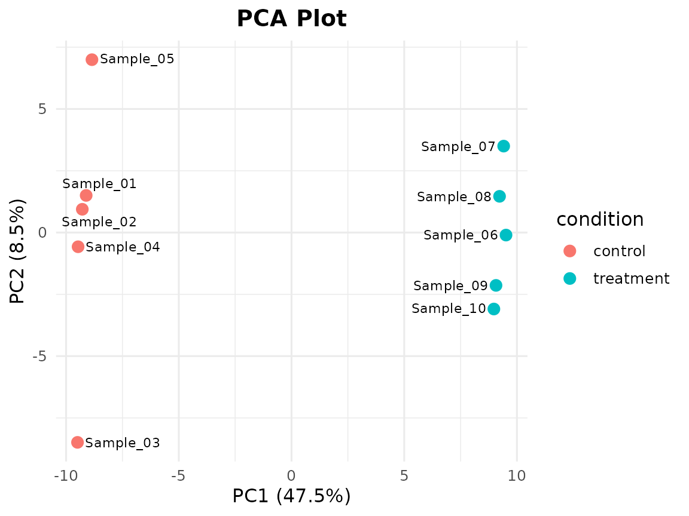
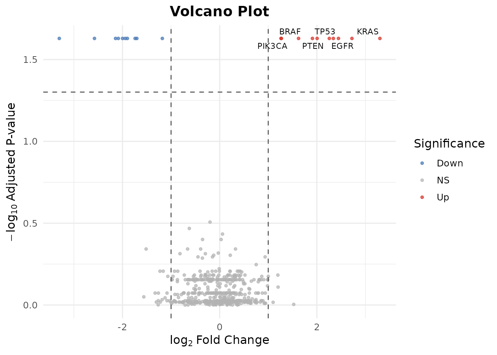
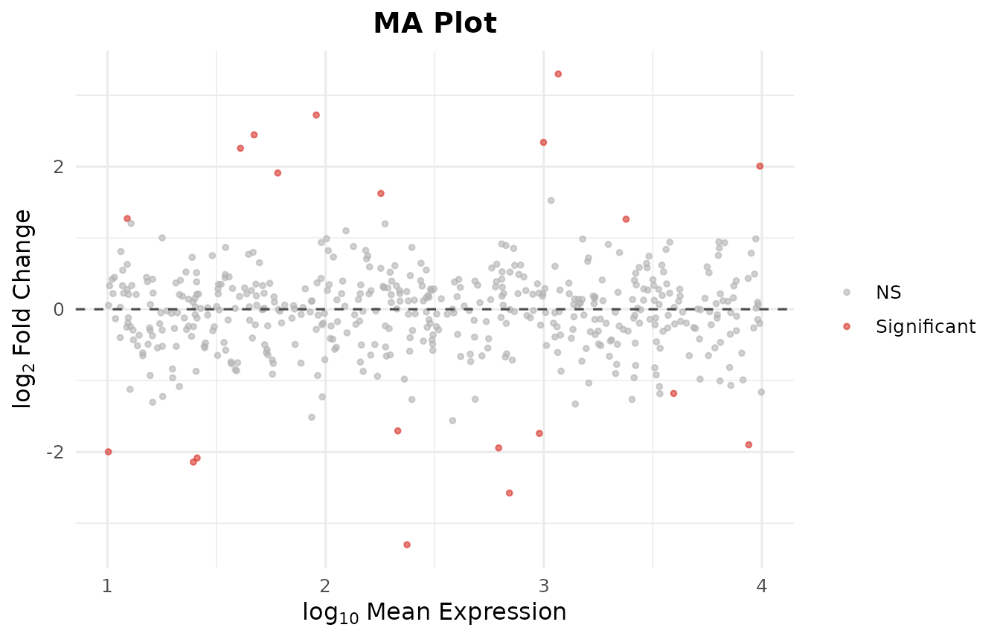
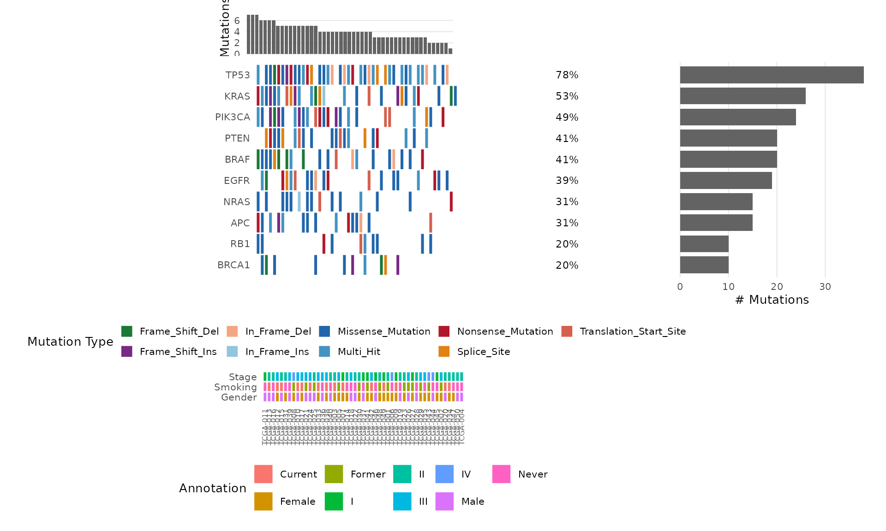

# 5-Minute Tutorial: RNA-Seq Analysis with bambamR


This tutorial walks through a complete RNA-seq analysis in under 5
minutes using only bambamR’s built-in example data. **No Bioconductor
packages are required.**

## Load the Package

``` r
library(bambamR)
#> bambamR: Full mode (all Bioconductor packages available)
```

## 1. Load Data and Normalize

``` r
# Bundled example: 200 genes x 10 samples (5 control, 5 treatment)
ex <- bb_example_counts()
cpm <- bb_normalize(ex$counts, method = "cpm")
cat(nrow(cpm), "genes,", ncol(cpm), "samples\n")
#> 200 genes, 10 samples
```

## 2. PCA: Do the Groups Separate?

``` r
bb_pca(cpm, ex$metadata, color_by = "condition", label = TRUE)
```



## 3. Volcano Plot: What Changed?

Use the pre-computed DE results (no Bioconductor needed):

``` r
de <- bb_example_de()
bb_volcano(de, fc_cutoff = 1, p_cutoff = 0.05, n_label = 6)
#> Warning: Removed 494 rows containing missing values or values outside the scale range
#> (`geom_text_repel()`).
```



## 4. MA Plot: Effect vs. Expression

``` r
bb_ma_plot(de)
```



## 5. Heatmap: Top DE Genes

``` r
bb_heatmap(cpm, de_result = de, n_genes = 20)
```


## 6. Oncoplot: Mutation Landscape

``` r
mut <- bb_example_mutations()
bb_oncoplot(mut$mutations, n_genes = 10, annotation_df = mut$clinical)
```



## 7. Export

``` r
bb_export_csv(de, "my_results.csv")
```

## Done!

In 7 steps you went from a count matrix to publication-ready PCA,
volcano, MA, heatmap, and onco plots – all without Bioconductor.

### What’s next?

- With Bioconductor:
  [`bb_deseq2()`](https://rabanheller.github.io/bambamR/reference/bb_deseq2.md),
  [`bb_edger()`](https://rabanheller.github.io/bambamR/reference/bb_edger.md),
  [`bb_limma_voom()`](https://rabanheller.github.io/bambamR/reference/bb_limma_voom.md)
  for real DE analysis
- From raw data:
  [`bb_pipeline()`](https://rabanheller.github.io/bambamR/reference/bb_pipeline.md)
  handles FASTQ -\> alignment -\> counts -\> DE -\> plots
- Interactive:
  [`bb_run_app()`](https://rabanheller.github.io/bambamR/reference/bb_run_app.md)
  launches a Shiny dashboard
- Customization: every plot returns a ggplot2 object, so add
  `+ theme()`, `+ labs()`, `+ scale_*()` as needed
- See
  [`vignette("bambamR-quickstart")`](https://rabanheller.github.io/bambamR/articles/bambamR-quickstart.md)
  for the full walkthrough and
  [`vignette("bambamR-oncoplot")`](https://rabanheller.github.io/bambamR/articles/bambamR-oncoplot.md)
  for oncoplot customization
