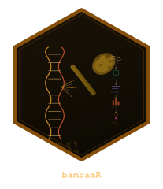

```{r setup, include = FALSE}
knitr::opts_chunk$set(
  collapse = TRUE,
  comment = "#>",
  fig.width = 10,
  fig.height = 7
)
```

```{r logo, echo = FALSE, out.width = "150px", fig.align = "right"}

```

## Overview

The `bb_oncoplot()` function creates publication-ready onco plots (waterfall
plots) showing the mutation landscape across samples. It is built entirely
with ggplot2 and returns a modifiable ggplot object.

```{r library}
library(bambamR)
library(ggplot2)
```

## Input Data Format

`bb_oncoplot()` accepts two input formats:

### Simple format

A data.frame with columns `sample`, `gene`, and `mutation_type`:

```{r simple-data}
# Load bundled example mutation data
ex <- bb_example_mutations()
mut_data <- ex$mutations
clinical_data <- ex$clinical
head(mut_data)
```

### MAF format

A data.frame with MAF-style columns: `Hugo_Symbol`,
`Tumor_Sample_Barcode`, `Variant_Classification`.

## Basic Oncoplot

```{r basic-oncoplot, fig.width=10, fig.height=6}
bb_oncoplot(mut_data, n_genes = 10)
```

## Customizing Colors

Pass a named character vector to `mutation_colors`:

```{r custom-colors, fig.width=10, fig.height=6}
my_colors <- c(
  "Missense_Mutation" = "#3182BD",
  "Nonsense_Mutation" = "#E6550D",
  "Frame_Shift_Del"   = "#31A354",
  "Frame_Shift_Ins"   = "#756BB1",
  "Splice_Site"       = "#DE2D26",
  "In_Frame_Del"      = "#636363",
  "Multi_Hit"         = "#FDAE6B",
  "Other"             = "#BDBDBD"
)

bb_oncoplot(mut_data, n_genes = 10, mutation_colors = my_colors)
```

## Selecting Specific Genes

```{r select-genes, fig.width=10, fig.height=5}
bb_oncoplot(mut_data, genes = c("TP53", "KRAS", "PIK3CA", "BRAF", "EGFR"))
```

## Adding Clinical Annotations

Provide a data.frame with sample annotations:

```{r annotations, fig.width=10, fig.height=7}
# Use the bundled clinical annotations
bb_oncoplot(mut_data, n_genes = 8, annotation_df = clinical_data)
```

## Sorting Options

Sort samples by mutation frequency (default) or by co-occurrence clustering:

```{r sort-cluster, fig.width=10, fig.height=6}
bb_oncoplot(mut_data, n_genes = 8, sort_by = "cluster")
```

## Customizing with ggplot2

Since `bb_oncoplot()` returns a ggplot object, you can further customize:

```{r customize, fig.width=10, fig.height=6}
p <- bb_oncoplot(mut_data, n_genes = 8, show_barplot = FALSE,
                  title = "Mutation Landscape")
p + theme(legend.position = "right")
```

## Exporting Publication-Quality Figures

```{r export, eval = FALSE}
p <- bb_oncoplot(mut_data, n_genes = 15, title = "Cohort Mutation Landscape")
ggsave("oncoplot.pdf", p, width = 12, height = 8, dpi = 300)
ggsave("oncoplot.png", p, width = 12, height = 8, dpi = 300)
```
